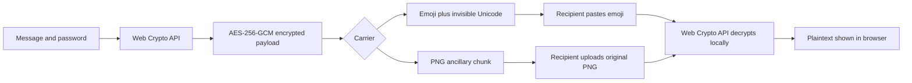

# Hush — Private messages in plain sight

**Hush** is a privacy-focused web application by **AQERIONX**. It encrypts a short note in the user's browser and carries the encrypted payload with a familiar emoji message or PNG image. Hush is designed as a static academic project: there is no message API, database, account system, or server-side decryption.

- **Live website:** [hush.aqerionx.in](https://hush.aqerionx.in/)
- **Source repository:** [github.com/monu-2008/hush](https://github.com/monu-2008/hush)
- **Project type:** Static web application / privacy and applied cryptography
- **Status:** Deployed on Vercel with HTTPS

## Abstract

People often want to share a private note without placing it in the visible text of a chat. Hush explores a client-side approach: encrypt the note with a password, attach the encrypted payload to a user-selected emoji or image, and let the recipient decrypt it locally with the same password. This project demonstrates browser-native cryptography, PNG chunk handling, Unicode text processing, and static web deployment.

## Problem statement

Ordinary chat messages expose their text to anyone who can see the conversation. Hush provides a small educational demonstration of password-based encryption and portable message containers. It does not claim that an emoji or image hides the existence of a payload; it protects the note's contents through encryption.

## Objectives

- Encrypt and decrypt notes entirely in a modern browser.
- Allow a user-provided emoji, including multi-code-point emoji sequences, to carry an encrypted text payload.
- Support ordinary user-provided images by placing the encrypted payload in a PNG ancillary chunk.
- Keep the interface responsive and usable on mobile and desktop.
- Explain privacy boundaries and carrier limitations clearly.
- Deploy as a static site with HTTPS, crawlable metadata, a sitemap, and a permissive robots policy.

## Features

- **Emoji carrier:** Copy a familiar emoji followed by invisible Unicode Variation Selectors (U+FE00–U+FE0F) that encode the encrypted payload. Variation Selectors are the same invisible characters chat apps already need to render emoji such as ❤️, so the payload survives Instagram, WhatsApp, Messenger and most modern chat apps.
- **Image carrier:** Add the encrypted payload to a PNG image chunk. JPEG, WebP, and GIF inputs are converted to PNG; the first frame is used for animated GIFs.
- **Password-based encryption:** AES-256-GCM with a key derived using PBKDF2-SHA-256 and 310,000 iterations.
- **Client-side processing:** Message, password, and image stay in the browser; there is no application backend.
- **Encode and decode flows:** Drag-and-drop or select files, copy or download the result, and show validation and error states.
- **Accessible responsive UI:** Semantic headings, labels, live status text, keyboard-operable controls, and light/dark themes.

## Architecture and data flow



The static client is split into three main layers:

1. `index.html` provides the interface and page metadata.
2. `app.js` handles UI events, image selection, status messages, and browser file operations.
3. `core.js` contains reusable encryption, emoji-payload, and PNG-container functions.

## Cryptography and privacy model

- The browser's **Web Crypto API** generates random salt and nonce values.
- PBKDF2-SHA-256 derives a 256-bit key from the password using 310,000 iterations.
- AES-GCM authenticates and encrypts the note. A wrong password or changed payload fails authentication.
- No note, password, or selected image is sent to an application server. Hosting providers still receive ordinary web request metadata such as a page request; Hush's code does not transmit the note or password.
- A forgotten password cannot be recovered. Share the password separately through a trusted channel.

### Important limitations

- Emoji carriers use Unicode Variation Selectors (U+FE00–U+FE0F). These are the same invisible characters chat apps already require to render emoji such as ❤️, so the payload survives Instagram, WhatsApp and Messenger. Older Hush builds used zero-width characters (ZWSP/ZWNJ) which some apps stripped; the decoder still reads those legacy messages for backward compatibility. If a chat app ever strips the Variation Selectors, send the PNG as a file or document instead.
- The PNG container preserves visible image pixels, but stores the payload in a PNG metadata chunk. It is **not pixel-level steganography**; inspection can reveal that an encrypted payload exists.
- Messaging and social platforms may recompress images, remove metadata, or convert formats. Send the original PNG as a file or document rather than as a recompressed photo.
- The generated emoji-like PNG is an image/sticker file, not a built-in Unicode emoji character.
- Hush is an educational privacy tool, not a substitute for a security review or an end-to-end encrypted messaging product.

## Technology stack

- HTML5 and CSS3
- Vanilla JavaScript ES modules
- Web Crypto API (`PBKDF2`, `AES-GCM`)
- PNG binary chunk parsing and CRC validation
- Node.js built-in test runner for core logic
- GitHub for source and Vercel for static hosting

## Run locally

Web Crypto requires a secure context. Browsers treat `localhost` as secure; opening `index.html` directly through `file://` may disable cryptography.

```bash
npm start
```

Then open [http://localhost:8000](http://localhost:8000). Python 3 is used only to serve the static files; the app has no runtime package dependencies.

## Tests

Run the core encryption, emoji, and PNG-container tests with Node.js 20 or newer:

```bash
npm test
```

The suite covers Unicode round trips, cryptographic parameters, wrong-password rejection, custom emoji sequences, replacement of existing payloads, and invalid PNG input.

## Deployment

The project is connected to GitHub and deployed on Vercel as a static site. The production URL is [https://hush.aqerionx.in](https://hush.aqerionx.in). No build command, environment variables, backend, or database are required. Vercel serves the static files over HTTPS and applies the security headers in `vercel.json`.

For another static host, publish the contents of this directory and configure HTTPS. Update the canonical URL, Open Graph URLs, `robots.txt`, `sitemap.xml`, and `llms.txt` if using a different domain.

## Search and AI discovery files

- `robots.txt` permits crawlers and points to the sitemap.
- `sitemap.xml` lists the canonical homepage.
- `index.html` includes a canonical URL, page description, Open Graph and Twitter card metadata, and WebApplication structured data.
- `llms.txt` provides a concise plain-text project description and privacy limitations for AI crawlers and readers.
- `favicon.svg`, `og-image.png`, and `og-image.svg` provide the browser icon, social-sharing image, and editable vector source for that image.

These files help crawlers understand and discover the site; they do not guarantee indexing, rich results, or search ranking. A site owner can also verify the domain and submit the sitemap in Google Search Console or the relevant search engine's webmaster tools.

## Project structure

| File | Purpose |
| --- | --- |
| `index.html` | User interface, accessibility semantics, page metadata, and structured data |
| `styles.css` | Responsive glass UI, themes, and project information section |
| `app.js` | Encode/decode interactions, validation, drag-and-drop, copy, and download |
| `core.js` | Encryption, emoji payload, and PNG container primitives |
| `core.test.js` | Automated core behavior tests |
| `vercel.json` | Static deployment security headers |
| `robots.txt` | Search crawler policy and sitemap location |
| `sitemap.xml` | Canonical homepage sitemap |
| `llms.txt` | Plain-text overview for AI crawlers and readers |
| `favicon.svg` | Browser tab icon |
| `og-image.png` | 1200 × 630 social-sharing preview image |
| `og-image.svg` | Editable vector source for the social-sharing artwork |

## Academic project summary

**Title:** Hush — Privacy-focused hidden-message container tool  
**Domain:** Web development, applied cryptography, and privacy engineering  
**Core learning outcomes:** Web Crypto API, password-based key derivation, authenticated encryption, binary file formats, Unicode, accessibility, SEO metadata, and static deployment.

## Acknowledgements

Built as an AQERIONX project using standards-based browser capabilities and open web technologies.

